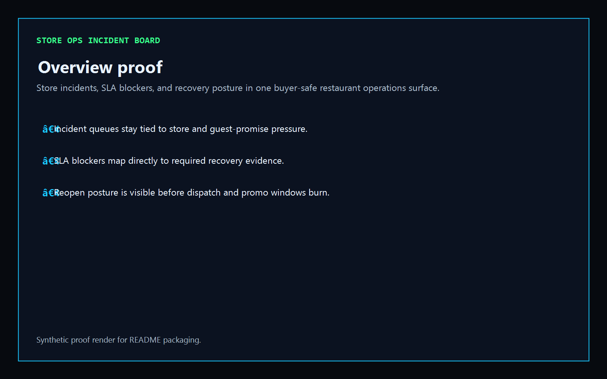
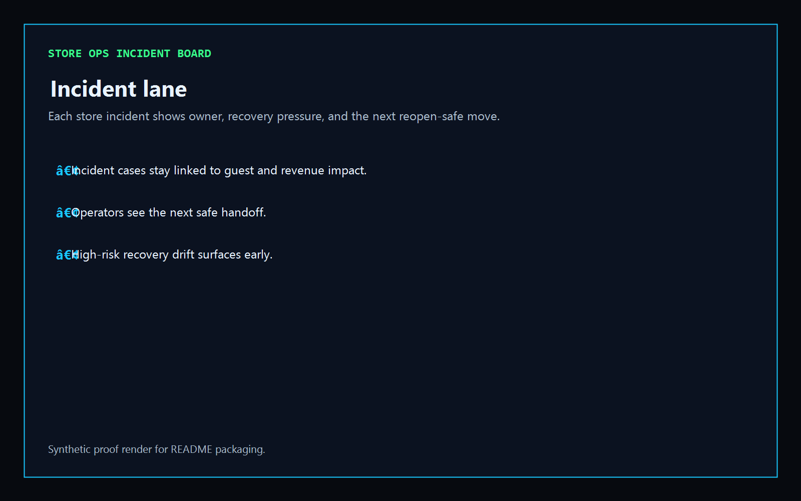
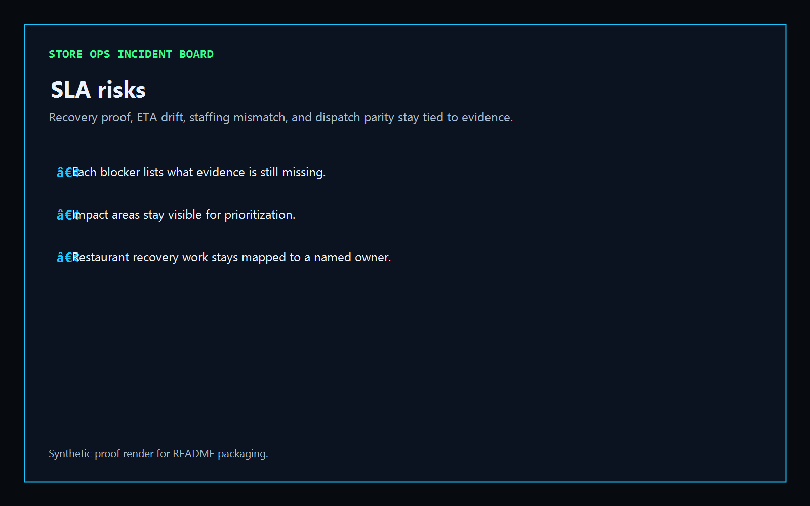
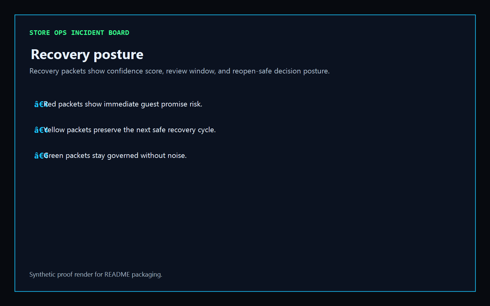

# Store Ops Incident Board

[](https://github.com/mizcausevic-dev/store-ops-incident-board/actions/workflows/ci.yml)
[](./LICENSE)
[](./.github/dependabot.yml)
[](https://github.com/mizcausevic-dev/store-ops-incident-board/actions/workflows/pages.yml)

TypeScript control plane for store incidents, SLA blockers, recovery posture, and buyer-safe restaurant operations.

## Why this exists

- Restaurant teams lose guest trust when store incidents, staffing recovery, dispatch promises, and franchise proof bundles drift at different speeds.
- Store operations need a clear view of which incidents are active, which SLA blockers still need evidence, and which reopen packets should not move yet.
- Food / Restaurant Tech buyers care whether incident recovery and guest-promise posture can stay safe without fragmenting store, labor, and dispatch workflows.
- Operators want tooling that turns incident chaos into governed lanes, named ownership, and measurable reopen posture.

## Why this matters (KG Embedded tie-back)

This repo demonstrates the store-incident primitive for Food / Restaurant Tech buyers: incident events, recovery blockers, and reopen-facing posture tied into one operator surface. A B2B SaaS buyer would care because store, dispatch, and labor events often need to surface inside customer-facing or operator-facing products without exposing unsafe write paths or fragmented operational evidence. Kinetic Gain Embedded extends this into security-first in-product analytics for incident recovery, guest-promise safety, and buyer-readable multi-location workflows, see [kineticgain.com/embedded](https://kineticgain.com/embedded).

## Routes

- `/`
- `/incident-lane`
- `/sla-risks`
- `/recovery-posture`
- `/verification`
- `/docs`

## API

- `/api/dashboard/summary`
- `/api/incident-lane`
- `/api/sla-risks`
- `/api/recovery-posture`
- `/api/verification`
- `/api/sample`

## Screenshots






## Local Development

```powershell
cd store-ops-incident-board
npm install
npm run dev
```

Open:
- [http://127.0.0.1:5584/](http://127.0.0.1:5584/)
- [http://127.0.0.1:5584/incident-lane](http://127.0.0.1:5584/incident-lane)
- [http://127.0.0.1:5584/sla-risks](http://127.0.0.1:5584/sla-risks)
- [http://127.0.0.1:5584/recovery-posture](http://127.0.0.1:5584/recovery-posture)
- [http://127.0.0.1:5584/verification](http://127.0.0.1:5584/verification)
- [http://127.0.0.1:5584/docs](http://127.0.0.1:5584/docs)

## Validation

- `npm run build`
- `npm run test`
- `npm run coverage`
- `npm run demo`
- `npm run smoke`
- `npm run prerender`
- `npm run render:assets`

## Production status

| Aspect | Status |
|--------|--------|
| CI | Node 20 + 22 matrix - lint, typecheck, coverage, build, demo, smoke, `npm audit` ([workflow](./.github/workflows/ci.yml)) |
| Test coverage | Example coverage gate is wired through Vitest |
| License | [AGPL-3.0-or-later](./LICENSE) |
| Dependencies | Dependabot weekly (npm + GitHub Actions); `npm audit --audit-level=high` in CI |
| Security | [SECURITY.md](./SECURITY.md) |
| Deploy | Static prerender -> [https://stores.kineticgain.com/](https://stores.kineticgain.com/) (GitHub Pages, [pages workflow](./.github/workflows/pages.yml)) |

## Docs

- [Architecture](./docs/architecture.md)
- [Origin](./docs/ORIGIN.md)
- [Kinetic Gain Embedded tie-back](./docs/KINETIC_GAIN_EMBEDDED.md)
- [Changelog](./CHANGELOG.md)

## Part of the Kinetic Gain Suite

Operator surface in the [Kinetic Gain Suite](https://suite.kineticgain.com/) — a portfolio of buyer-readable control planes spanning security posture, compliance evidence, data-platform governance, FinOps, and operator workflows. See the suite index for related surfaces. Apex: [kineticgain.com](https://kineticgain.com/).
